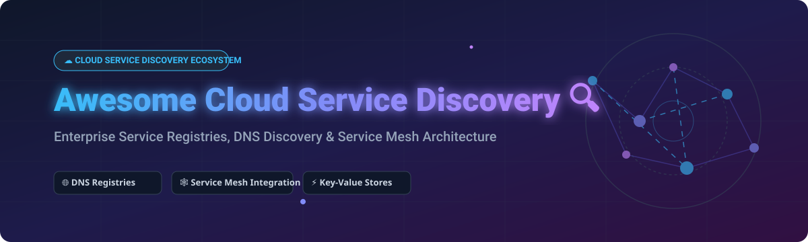

# Awesome-Cloud-Service-Discovery 🔍 ☁️

  

  
  
  
  
  

---

## 🌟 Top Cloud Service Discovery Ecosystem

**Curated List of Commercial Service Discovery Platforms & Open-Source Service Registry Tools**  
*Focused on DNS-Based Discovery, Key-Value Registries, Service Mesh Integration, Health Checking & Self-Hosted Service Catalogs*

**Last updated: October 2026** 📅

---

### 📌 Overview & SEO Summary

Welcome to the ultimate curated directory of **cloud service discovery platforms**, **open-source service registry tools**, and **DNS-based discovery frameworks**. Cloud service discovery enables microservices, containers, and distributed workloads to dynamically locate and communicate with each other across dynamic cloud infrastructure. 

Whether you are evaluating enterprise-grade managed cloud service discovery solutions (such as *AWS Cloud Map*, *HashiCorp Consul*, *Traefik Enterprise*, *Buoyant Cloud*, and *Netflix Eureka*), or self-hostable open-source alternatives (like *Traefik*, *etcd*, *Istio*, *CoreDNS*, *Apache ZooKeeper*, *Linkerd*, and *SkyDNS*), this repository provides an up-to-date, comprehensive comparison of architecture, star metrics, licensing, market size, and pricing.

---

## 📑 Table of Contents

- [🏢 SaaS & Commercial Platforms](#-saas--commercial-platforms)
- [🔓 Open-Source GitHub Projects](#-open-source-github-projects)
- [🛠️ How to Contribute](#%EF%B8%8F-how-to-contribute)
- [📊 Star History](#-star-history)
- [🤝 Support & Sponsorship](#-support--sponsorship)
- [⚠️ Disclaimer](#%EF%B8%8F-disclaimer)

---

## 🏢 SaaS / Commercial Platforms

The Global Cloud Service Discovery Market size is estimated at **$1.8 Billion - $2.5 Billion**, projected to grow at a CAGR of **~18.5%** driven by rapid adoption of microservices, serverless, and Kubernetes containerization. The market structure is **moderately fragmented**, split between hyperscale cloud provider native services (e.g. AWS Cloud Map), multi-cloud enterprise control planes (HashiCorp Consul / IBM), and commercial enterprise extensions built atop open-source service meshes (Traefik Enterprise, Enterprise Istio providers).

*Sorted by Company Valuation / Market Cap (Descending)* 📈

| SaaS / Commercial Platform | Company / Owner | Valuation / Market Cap | Standard Edition Starting Price | Free Tier / Free Trial Limits | Description |
| :--- | :--- | :--- | :--- | :--- | :--- |
| **[AWS Cloud Map](https://aws.amazon.com/cloud-map/)** ☁️ | Amazon | ~$2.0 Trillion | **$0.10** per registered resource / mo + **$1.00** per 1M DiscoverInstances API calls | **1,000 registered resources** & **1M API calls/mo** free for first 12 months under AWS Free Tier | **AWS-native service discovery** — Maps logical names to backend services and resources. Uses **DiscoverInstances API** or **DNS queries** for discovery. Returns only healthy resources. Integrates with Route 53 health checks. |
| **[Netflix Eureka](https://github.com/Netflix/eureka)** 🎬 | Netflix OSS | ~$290 Billion | **$0.00** (Open Source / Self-Hosted Infrastructure Costs Only) | **Free Forever** (Self-hosted open source) | **REST-based service discovery** — Netflix's battle-tested service registry for its vast microservice ecosystem. **Client-server model**: services register and send periodic heartbeats. Port 8761 commonly used. Java-based, part of Netflix OSS. |
| **[HashiCorp Consul](https://www.consul.io/)** 🔐 | HashiCorp (IBM) | ~$6.4 Billion (Acquired) | **$0.027** per node/hr (~$20/node/month for HCP Consul) | **$50 free credits** on HashiCorp Cloud Platform (HCP) valid for 30 days | **Multi-runtime service discovery** — **Consul DNS** enables application load balancing and static service lookups. **Prepared queries** for dynamic lookups and service failover across datacenters. Raft consensus for high availability. |
| **[Traefik Enterprise](https://traefik.io/traefik-enterprise/)** 🚦 | Traefik Labs | ~$100 Million (Series B) | **$60.00** per node / month (Billed annually) | **30-day full feature free trial** for unlimited nodes | **Enterprise API Gateway & Service Mesh** — Commercial tier of Traefik adding distributed service discovery, high availability control planes, and enterprise security integrations for Kubernetes and multi-cloud environments. |
| **[Buoyant Cloud (Linkerd)](https://buoyant.io/)** 🦊 | Buoyant | ~$50 Million (Series A) | **$0.50** per workload / month | **Free for non-production** & startups under 50 workloads | **Managed Linkerd Service Mesh** — Enterprise SaaS platform built around Linkerd providing automated service discovery management, mTLS key rotation, cluster topology visualization, and SLA monitoring. |

---

## 🔓 Open-Source GitHub Projects

*Sorted by GitHub Stars Count (Descending)* 🌟

- **[Traefik](https://github.com/traefik/traefik)**  🚦  
  **The Cloud Native Application Proxy & Service Discovery Router**, MIT licensed. **Written in Go**. Automatically discovers incoming microservices by querying orchestrators (Kubernetes, Docker Swarm, Consul, etcd, ECS) and updates routing rules dynamically without restarting processes. Built-in HTTP/TCP/UDP load balancing and Let's Encrypt TLS automation.

- **[etcd](https://github.com/etcd-io/etcd)**  🔑  
  **Distributed reliable key-value store for critical data**, Apache-2.0 licensed. **The foundational coordination service for Kubernetes** — stores all cluster state and endpoint metadata. **Service discovery via leases and watchers** — services register with a TTL lease, and clients watch keys for real-time endpoint updates. CoreDNS etcd plugin implements SkyDNS service discovery.

- **[Istio](https://github.com/istio/istio)**  🔷  
  **Open-source Service Mesh control plane**, Apache-2.0 licensed. **ServiceRegistry architecture** automatically aggregates service definitions across Kubernetes API servers and custom `ServiceEntry` definitions. Provides advanced traffic routing, load balancing, dynamic service discovery, zero-trust mTLS encryption, and observability across polyglot microservices.

- **[Consul](https://github.com/hashicorp/consul)**  🔐  
  **Distributed Service Mesh and Service Discovery solution**, Business Source License (BSL). Features multi-datacenter service registration, HTTP/DNS discovery interfaces, active health checking, KV storage, and Envoy proxy control plane integration.

- **[CoreDNS](https://github.com/coredns/coredns)**  🎯  
  **DNS server and service discovery framework**, Apache-2.0 licensed. **Written in Go**. **Chains plugins** — each plugin performs a DNS function like Kubernetes service discovery, Prometheus metrics, or zone file serving. **The de facto standard for Kubernetes DNS-based service discovery** — resolves internal pod and service domain queries (`.cluster.local`).

- **[Apache ZooKeeper](https://github.com/apache/zookeeper)**  🐘  
  **Distributed coordination service**, Apache-2.0 licensed. **Service discovery via ephemeral znodes** — backend instances register on startup, and ZooKeeper automatically purges znodes if client sessions expire or crash. Powers service registration for Apache Kafka, Hadoop, and enterprise distributed systems.

- **[Eureka](https://github.com/Netflix/eureka)**  🌐  
  **REST-based service registry server**, Apache-2.0 licensed. **Part of Netflix OSS** — battle-tested at Netflix's massive cloud scale. **Client-server model** with service registration, periodic heartbeats, and peer-to-peer registry replication across availability zones. Primary discovery engine for Spring Cloud Netflix applications.

- **[Linkerd2](https://github.com/linkerd/linkerd2)**  🦊  
  **Ultralight Kubernetes-native service mesh**, Apache-2.0 licensed. **Zero-config service discovery** using Kubernetes endpoints and custom Destination Controller service lookups. Uses ultra-fast Rust sidecar proxies for transparent load balancing, mTLS, and telemetry.

- **[SkyDNS](https://github.com/skynetservices/skydns)**  📡  
  **DNS service discovery backed by etcd**, MIT licensed. **The original etcd-based DNS service discovery engine** — pioneered mapping etcd key-value pairs directly to DNS SRV and A record lookups.

- **[Apache Helix](https://github.com/apache/helix)**  🎛️  
  **Cluster management and resource allocation framework**, Apache-2.0 licensed. Built on ZooKeeper with state-machine based service discovery, dynamic state routing, flapping detection, and declarative node partition management.

---

## 🛠️ How to Contribute

Contributions are welcome! Follow these steps to submit new service discovery platforms or open-source registry software:

1. 🍴 **Fork** the repository.
2. 📝 **Add/edit** entries in `README.md` maintaining table/list structure and formatting.
3. 🔗 Include project title, official website/GitHub link, exact Stars Count, license, and brief description.
4. 🚀 Submit a **Pull Request** with a descriptive summary of your changes.

---

## 📊 Star History

---

## 🤝 Support & Sponsorship

If you find this cloud service discovery repository useful, please consider supporting the project:

- ⭐ **Star** this repository to increase visibility!
- 🔀 **Fork** and share with fellow cloud architects, platform engineers, and open-source advocates.
- ☕ **Sponsor & Buy Me a Coffee**: Support ongoing open-source curation via the [GitHub Sponsor Dashboard](https://github.com/sponsors/ishandutta2007).

---

## ⚠️ Disclaimer

- This is a **community-curated** list — not exhaustive and not an endorsement. ℹ️
- **AWS Cloud Map pricing is pay-as-you-go** based on registered resources and API calls — **Route 53 DNS and health checks incur additional charges**.
- **Consul DNS and service discovery are enabled by default** — when service mesh is enabled, you can use **CoreDNS with transparent proxy**.
- **ZooKeeper session expiry causes loss of watches and ephemeral nodes** — servers must detect flapping and deregister. **Watch mode can trigger herd effect** with hundreds of clients — use **Poll mode** for large client counts.
- **Open-source tools (CoreDNS, etcd, ZooKeeper) are not turnkey** — they require **deployment, integration, and ongoing maintenance**. **Always validate service discovery with a proof-of-concept** before production deployment. 🔍

---

  <b>Made with ❤️ for cloud architects, platform engineers, and open-source service discovery advocates.</b>

